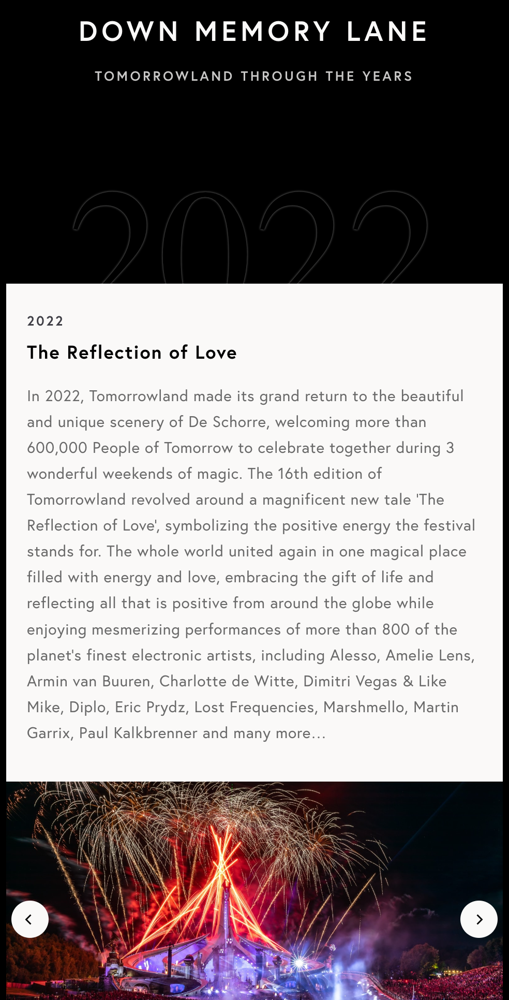
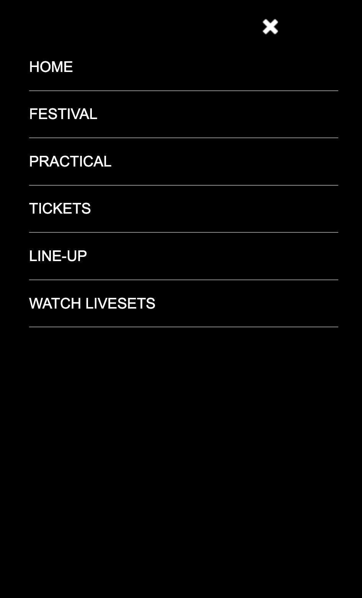

# Procesverslag
Markdown is een simpele manier om HTML te schrijven.  
Markdown cheat cheet: [Hulp bij het schrijven van Markdown](https://github.com/adam-p/markdown-here/wiki/Markdown-Cheatsheet).

Nb. De standaardstructuur en de spartaanse opmaak van de README.md zijn helemaal prima. Het gaat om de inhoud van je procesverslag. Besteedt de tijd voor pracht en praal aan je website.

Nb. Door *open* toe te voegen aan een *details* element kun je deze standaard open zetten. Fijn om dat steeds voor de relevante stuk(ken) te doen.

## Jij

  
uitwerken voor kick-off werkgroep

  ### Auteur:
  Elzo Stijger

  #### Je startniveau:
  Blauw met als doel naar rood te gaan

  #### Je focus:
  Surface plane
 

## Je website

  
uitwerken voor kick-off werkgroep

  ### Je opdracht:
  https://www.tomorrowland.com/

  #### Screenshot(s) van de eerste pagina (small screen): 
  Tomorrowland Belgium Festival - https://www.tomorrowland.com/en/festival/welcome
  
  
  

  #### Screenshot(s) van de tweede pagina (small screen):
  Tomorrowland Account - https://my.tomorrowland.com/register
  
  
 

## Toegankelijkheidstest 1/2 (week 1)

  
uitwerken na test in 1e werkgroep

  ### Bevindingen
  Lijst met je bevindingen die in de test naar voren kwamen:

  Tijdens het testen merkte ik dat mijn testpersoon moeilijk kon lezen wat er stond. 
  Dat kwam door de kleuren die gebruikt werden en doordat het lettergrote te klein is. Er 
  was ook veel content op de website waardoor je werd overvallen door de hoeveelheid
  informatie. Hierdoor ging de concentratie ook snel weg. 

  

  #### Screenreader
  Hier korte omschrijving (met indien nodig afbeeldingen)
  Hier een omschrijving van hoe het opgelost kan worden (met indien nodig afbeeldingen)

  Deze website is erg slecht voor blinden. Er zit namelijk zoveel content op 1 pagina, dat
  je als bezoeker helemaal gek word. Je kan dan beter minder content tonen en meer verschillende
  pagina's maken.

  #### Muis en Toetsenbord 
  Hier korte omschrijving (met indien nodig afbeeldingen)
  Hier een omschrijving van hoe het opgelost kan worden (met indien nodig afbeeldingen)

  Je kan het oplossen door touchscreen of een voicecommand toetepassen op de website. 

  #### Motoriek (shocks, elastiekjes)
  Hier korte omschrijving (met indien nodig afbeeldingen)
  Hier een omschrijving van hoe het opgelost kan worden (met indien nodig afbeeldingen)

  Het is lastig als je bepaalde bewegingen niet kan doen. Hierbij zou ook een goede oplossing
  zijn om een voicecommand toe te voegen. Hierdoor hoef je geen bewegingen uit te voeren.

  

  #### Visueel (brillen, contrast, kleurenblind, dark/light). 
  Hier korte omschrijving (met indien nodig afbeeldingen)

  Hier een omschrijving van hoe het opgelost kan worden (met indien nodig afbeeldingen)

  De problemen die opkwamen tijdens de test kan makkelijk worden opgelost, door het lettergrote
  groter te maken. Ook andere kleuren gebruiken. En meer stappen of pagina's te maken zodat
  je niet in 1x wordt overvallen door de vele informatie.

  

## Breakdownschets (week 1)

  
uitwerken na afloop 2e werkgroep

  ### de hele pagina: 
  

  ### dynamisch deel (bijv menu): 
  

## Voortgang 1 (week 2)

  
uitwerken voor 1e voortgang

  ### Stand van zaken
  hier dit ging goed & dit was lastig (neem ook screenshots op van delen van je website en code)

  Ik had de eerste twee weken nog niet iets van html of css. Alleen een uitwerking van een menu.
  Het was lastig om weer te beginnen met html en css. Het was een aantal geleden dat we daarmee
  iets hadden gedaan en ik had daar moeite mee om te beginnen. Door opdrachten proberen te maken
  probeerde ik het beter onder de knie te krijgen.

  ### Verslag van meeting
  hier na afloop snel de uitkomsten van de meeting vastleggen

  - Begin gwn
  - Zet alle content alvast in je html 
  - Kijk daarna verder naar de css

## Voortgang 2 (week 3)

  
uitwerken voor 2e voortgang

  ### Stand van zaken
  hier dit ging goed & dit was lastig (neem ook screenshots op van delen van je website en code)

  Ik ben vaak opnieuw begonnen met mijn website, omdat iets niet lukte. De oefeningen/opdrachten waren 
  daarom ook erg lastig. Ik begon er weliets beter in te worden met bijvoorbeeld met plaatsing van 
  dingen door flexbox. Alleen de rest was nog erg lastig.

  ### Agenda voor meeting

  [ik kon er niet bij zijn omdat ik een afspraak had. Ik heb daarom een afspraak gemaakt met de student-assistente]

  ### Verslag van meeting
  hier na afloop snel de uitkomsten van de meeting vastleggen

  - Ik heb nog wel veel te doen. 
  - Begin gwn
  - Maak als tweede pagina de account pagina
  - Volgende week heb je de content op de je eerste html pagina af 

## Toegankelijkheidstest 2/2 (week 4)

  
uitwerken na test in 8e werkgroep

  ### Bevindingen
  Lijst met je bevindingen die in de test naar voren kwamen (geef ook aan wat er verbeterd is):

  De website had weinig overzicht. Alles zat nog niet op de juiste plek, het was niet goed responsive.
  Mijn website zag er een chaotisch uit. De kleur gebruik en de lettergrote was wel goed. Je kreeg wel
  een gevoel bij de website.

  

  #### Screenreader
  Hier korte omschrijving (met indien nodig afbeeldingen)
  Hier een omschrijving van hoe het opgelost kan worden (met indien nodig afbeeldingen)

  De content van mijn website is al minder dan de orginele. Alleen er zit veel structuur
  op mijn website. Je kan het beter simpeler maken, dan moeilijke dingen gebruiken positioneren. 
  De vele 2022 is ook heel vervelend. Dat wordt dan steeds herhaalt.

  #### Muis en Toetsenbord 
  Hier korte omschrijving (met indien nodig afbeeldingen)
  Hier een omschrijving van hoe het opgelost kan worden (met indien nodig afbeeldingen)

  Veel content zat in het midden. Daardoor hoefde je niet van de andere kant van de pagina
  naar de andere. Ik miste wel de focusstates. Als je de tab gebruikte, werd niet alle
  content geselecteerd.

  #### Motoriek (shocks, elastiekjes)
  Hier korte omschrijving (met indien nodig afbeeldingen)
  Hier een omschrijving van hoe het opgelost kan worden (met indien nodig afbeeldingen)

  De website kon je makkelijk navigeren. Veel content waar je overheen kon hoveren en klikken
  zat in het midden. Hierdoor hoefde je niet van de ene kant naar de andere kant.

  #### Visueel (brillen, contrast, kleurenblind, dark/light). 
  Hier korte omschrijving (met indien nodig afbeeldingen)

  Hierbij kan ik nog kijken om voor light en dark mode nog iets te maken. Zodat je op verschillende
  locaties en omgevingen op een fijne manier naar de site kan kijken

## Voortgang 3 (week 4)

  
uitwerken voor 3e voortgang

  ### Stand van zaken
  hier dit ging goed & dit was lastig (neem ook screenshots op van delen van je website en code)

  Ik begon eindelijk een beetje lekker te werken. Bepaalde dingen lukte eindelijk en ik begon
  het beter te snappen. Voor mij gevoel ging alles wel goed. Ik had nog wel veel te doen. Ik
  had nog niet mijn eerste pagina af en was nog niet begonnen met mijn css

  ### Agenda voor meeting
  samen met je groepje opstellen

  Ik had zelf een vraag over de vormgeving van mijn website. Een achtergrond wilde niet meer
  alles coveren. Ik snapte niet waarom dat niet werkte.

  ### Verslag van meeting
  hier na afloop snel de uitkomsten van de meeting vastleggen

  - Begin opnieuw: hierdoor krijg je weer een betere blik op de website
  - Maak de website van Tomorrowland gwn na. Maak het niet je eigen, dat kost tijd
  - Maak je website een beetje responsive
  - Leer beter over position absolute

## Eindgesprek (week 5)

  
uitwerken voor eindgesprek

  ### niet bij het eindgesprek 
  Doordat ik opnieuw moest beginnen met mijn website, had ik niet genoeg tijd in 1 week
  om twee pagina's volledig af te maken met animaties etc. Ik koos er voor om op mijn
  tempo in de vakantie en de weken tot de herkansing aan de website te werken. En de 
  leerpunten die ik bij het laatste feedback gesprek heb gekregen, mee te nemen naar
  mijn huidige website.

## Ontdekken (week 6/7/8/9)

  
Tussen eindgesprek en verkansing

  ### leren ontdekken
  Tussen de periode van het eindgesprek en de herkansing ben ik erg bezig geweest met het
  begrijpen van de codes. Samen met studiegenoten gingen we samen aan de slag met de code
  om elkaar te motiveren en aan te moedigen. Ik leerde steeds beter de code begrijpen en 
  begon meer te spelen. Zo leerde ik meer hoe ik met 'translate' de 'postion absolute' beter
  responsive kan krijgen. Ook begon ik het leuker te vinden. Door bijvoorbeeld hovers en 
  animaties toe te hebben gevoegd.

## Herkansing (week 10)

  
uitwerken voor eindgesprek

  ### Je uitkomst - karakteristiek screenshots:
  
  
  
  
  

  ### Dit ging goed/Heb ik geleerd: 
  Korte omschrijving met plaatjes

  Wat ik erg heb geleerd om een beetje een responsive website te hebben, terwijl je 
  'position: absolute' gebruikt.
  
  

  Verder ben ik me vrijer gaan voelen met html en css. Ik begon steeds meer dingen te ontdekken
  en werd ook enthousiast van. Het begin was alleen ff moeilijk, maar toen ik eenmaal begon ging ik ervoor!

  ### Dit was lastig/Is niet gelukt:
  Korte omschrijving met plaatjes

  Ik wilde bij dit gedeelte ervoor zorgen dat er een 3D-effect kwam met draaien. Dat er
  op de andere kant andere content staat dan de voorkant
  

## Bronnenlijst

  
continu bijhouden terwijl je werkt

  Nb. Wees specifiek ('css-tricks' als bron is bijv. niet specifiek genoeg).

  1. https://campus.w3schools.com/
  2. https://codepen.io

